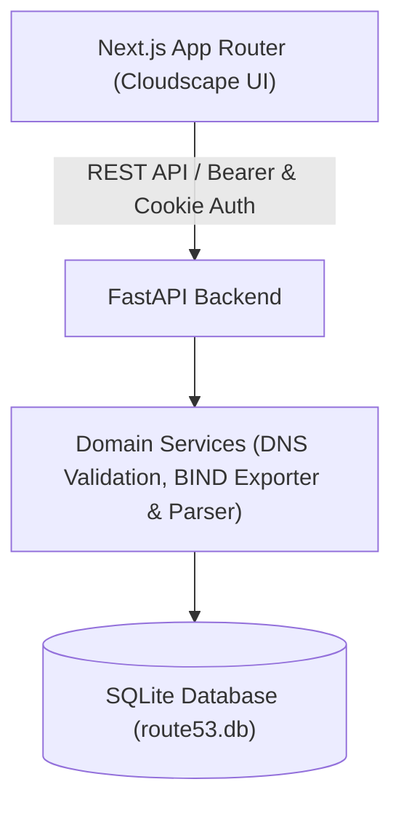

# AWS Route 53 Web Application Clone

A full-stack clone of the AWS Route 53 web application built with **Next.js** (TypeScript) and **FastAPI** (Python), using the **AWS Cloudscape Design System** and **SQLite**.

---

## 🏗 Architecture Overview



- **Frontend**: Next.js 14, `@cloudscape-design/components`, `@cloudscape-design/global-styles`, `@tanstack/react-query`.
- **Backend**: FastAPI, SQLAlchemy ORM, SQLite (`PRAGMA foreign_keys=ON;`).
- **Core Features**: Hosted Zone CRUD (auto-seeded AWS NS & SOA records), DNS Record management (`A`, `AAAA`, `CNAME`, `TXT`, `MX`, `NS`, `PTR`, `SRV`, `CAA`), BIND `.zone` export & import, AWS Light/Dark mode toggle, keyboard shortcuts (`C`, `R`, `/`, `Esc`).

---

## 🗄 Database Schema

```sql
users (
  id INTEGER PRIMARY KEY,
  username TEXT UNIQUE NOT NULL,
  password_hash TEXT NOT NULL
);

hosted_zones (
  id INTEGER PRIMARY KEY,
  name TEXT NOT NULL,
  comment TEXT,
  is_private BOOLEAN DEFAULT FALSE,
  created_at TIMESTAMP DEFAULT CURRENT_TIMESTAMP,
  updated_at TIMESTAMP DEFAULT CURRENT_TIMESTAMP
);

dns_records (
  id INTEGER PRIMARY KEY,
  hosted_zone_id INTEGER NOT NULL REFERENCES hosted_zones(id) ON DELETE CASCADE,
  name TEXT NOT NULL,
  type TEXT NOT NULL CHECK(type IN ('A','AAAA','CNAME','TXT','MX','NS','PTR','SRV','CAA','SOA')),
  ttl INTEGER NOT NULL DEFAULT 300,
  routing_policy TEXT NOT NULL DEFAULT 'simple',
  created_at TIMESTAMP DEFAULT CURRENT_TIMESTAMP,
  updated_at TIMESTAMP DEFAULT CURRENT_TIMESTAMP
);

record_values (
  id INTEGER PRIMARY KEY,
  record_id INTEGER NOT NULL REFERENCES dns_records(id) ON DELETE CASCADE,
  value TEXT NOT NULL
);
```

---

## 🔌 API Overview

| Method | Endpoint | Description |
|---|---|---|
| `GET` | `/health` | Server health check |
| `POST` | `/auth/login` | Authenticate user & issue session |
| `POST` | `/auth/logout` | Terminate session cookie |
| `GET` | `/auth/me` | Retrieve current user session |
| `GET` | `/hosted-zones` | List hosted zones (search, pagination) |
| `POST` | `/hosted-zones` | Create hosted zone (auto-seeds NS & SOA) |
| `GET` | `/hosted-zones/{id}` | Get zone details |
| `PUT` | `/hosted-zones/{id}` | Update zone description |
| `DELETE` | `/hosted-zones/{id}` | Delete zone (cascade deletes records) |
| `GET` | `/hosted-zones/{id}/export` | Export zone as BIND (`format=bind`) or JSON (`format=json`) |
| `POST` | `/hosted-zones/{id}/import` | Import BIND zone file content into zone |
| `GET` | `/hosted-zones/{id}/records` | List DNS records (search, type filter) |
| `POST` | `/hosted-zones/{id}/records` | Create DNS record |
| `PUT` | `/hosted-zones/{id}/records/{rec_id}` | Update DNS record |
| `DELETE` | `/hosted-zones/{id}/records/{rec_id}` | Delete DNS record |

---

## ⚙️ Setup Instructions

### Backend Setup
```bash
cd backend
python -m venv venv

# Windows:
.\venv\Scripts\activate
# Linux/macOS:
# source venv/bin/activate

pip install -r requirements.txt

# Run Automated Test Suite
python -m pytest tests/test_api.py -v

# Run FastAPI Server
python -m uvicorn app.main:app --host 127.0.0.1 --port 8001 --reload
```

Default Credentials:
- **Username**: `admin`
- **Password**: `admin123`

### Frontend Setup
```bash
cd frontend
npm install
npm run dev
```

Live Link : route53-clone-flax.vercel.app
