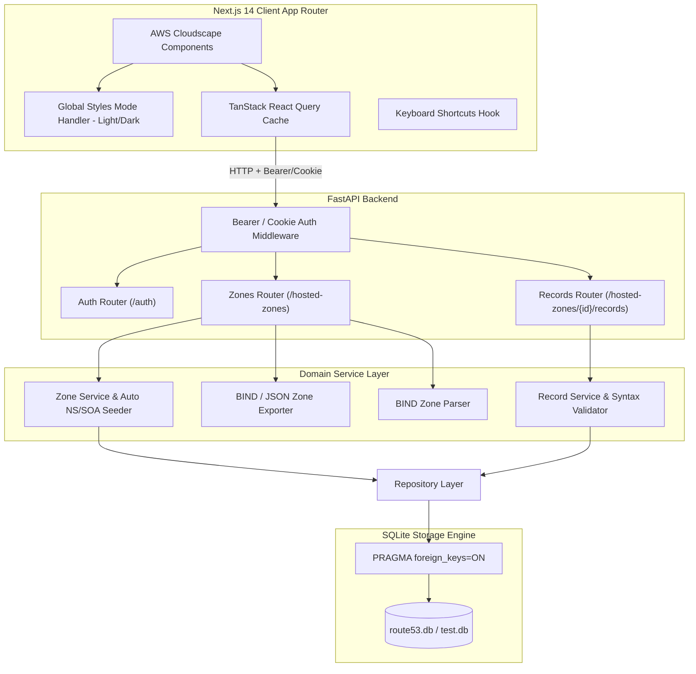
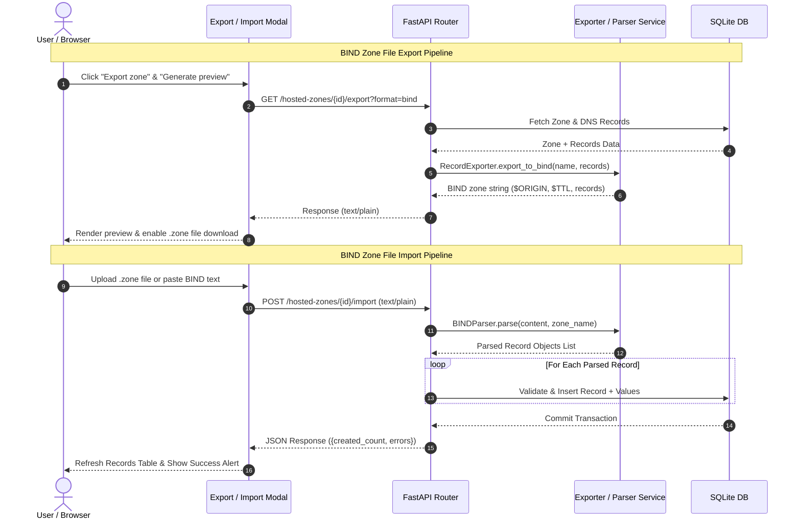

# AWS Route53 Web Application Clone

[](https://nextjs.org/)
[](https://fastapi.tiangolo.com/)
[](https://www.sqlite.org/)
[](https://cloudscape.design/)
[](https://docs.pytest.org/)

A full-stack, enterprise-grade clone of the **AWS Route53** web application built with **Next.js** (TypeScript), **FastAPI** (Python), and **SQLite**, designed using the official **AWS Cloudscape Design System**.

---

## 🌟 Features & Scope

### 🎨 AWS Cloudscape Design & Theme System
- **Authentic AWS Console UX**: Recreates AWS Console navigation using Cloudscape `AppLayout`, `TopNavigation`, `SideNavigation`, `BreadcrumbGroup`, `Tabs`, `Table`, `Modal`, and `Flashbar`.
- **AWS Dark Mode & Light Mode**: Seamless dark theme toggle integrated in `TopNavigation` via `@cloudscape-design/global-styles` (`applyMode(Mode.Dark)`), persisted in `localStorage`.

### 🌐 Hosted Zones & Automatic Records
- **Hosted Zone CRUD**: Create Public or Private hosted zones, update comments, and delete zones with full cascading record deletion.
- **Auto-Seeded AWS NS & SOA Records**: Creating a Hosted Zone automatically generates 4 authentic AWS Name Servers (`ns-xxx.awsdns-xx.org`) and an SOA record, matching AWS Route 53 behavior.

### 📜 BIND Zone File Import & Export
- **BIND Zone Export**: Export any Hosted Zone and its records to standard BIND `.zone` file syntax or structured JSON. Includes live preview and file download.
- **BIND Zone Import**: Upload or paste BIND zone files to parse `$ORIGIN`, `$TTL`, and record directives directly into a Hosted Zone.

### ⌨️ Global Keyboard Shortcuts
- **`C`**: Open Create modal (Hosted Zone or DNS Record)
- **`R`**: Refresh current table data
- **`/`**: Auto-focus table search input
- **`Esc`**: Instantly close active modal dialogs

### 🔐 Dual-Mode Authentication & Security
- **Cross-Domain Session Management**: Supports both HTTP-Only Cookies and `Authorization: Bearer <token>` fallback for cross-domain deployments (`vercel.app` -> `onrender.com`).
- **SQLite Integrity**: Connection-level Foreign Key enforcement via SQLAlchemy `PRAGMA foreign_keys=ON;` and ON DELETE CASCADE logic.

---

## 🏗 System Architecture



---

## 🔄 BIND Import & Export Data Flow



---

## 🗄 Database Schema

```sql
users (
  id INTEGER PRIMARY KEY,
  username TEXT UNIQUE NOT NULL,
  password_hash TEXT NOT NULL
);

hosted_zones (
  id INTEGER PRIMARY KEY,
  name TEXT NOT NULL,
  comment TEXT,
  is_private BOOLEAN DEFAULT FALSE,
  created_at TIMESTAMP DEFAULT CURRENT_TIMESTAMP,
  updated_at TIMESTAMP DEFAULT CURRENT_TIMESTAMP
);
CREATE INDEX idx_zones_name ON hosted_zones(name);

dns_records (
  id INTEGER PRIMARY KEY,
  hosted_zone_id INTEGER NOT NULL REFERENCES hosted_zones(id) ON DELETE CASCADE,
  name TEXT NOT NULL,
  type TEXT NOT NULL CHECK(type IN ('A','AAAA','CNAME','TXT','MX','NS','PTR','SRV','CAA','SOA')),
  ttl INTEGER NOT NULL DEFAULT 300,
  routing_policy TEXT NOT NULL DEFAULT 'simple',
  created_at TIMESTAMP DEFAULT CURRENT_TIMESTAMP,
  updated_at TIMESTAMP DEFAULT CURRENT_TIMESTAMP
);
CREATE INDEX idx_records_zone_name_type ON dns_records(hosted_zone_id, name, type);

record_values (
  id INTEGER PRIMARY KEY,
  record_id INTEGER NOT NULL REFERENCES dns_records(id) ON DELETE CASCADE,
  value TEXT NOT NULL
);
```

---

## 🔌 API Endpoints Reference

| Method | Endpoint | Description |
|---|---|---|
| `GET` | `/health` | Server health check (`{"status": "ok"}`) |
| `POST` | `/auth/login` | Authenticate user & return token + set cookie |
| `POST` | `/auth/logout` | Clear active session cookie |
| `GET` | `/auth/me` | Retrieve currently authenticated user session |
| `GET` | `/hosted-zones` | List hosted zones with search & pagination |
| `POST` | `/hosted-zones` | Create hosted zone (auto-seeds NS & SOA) |
| `GET` | `/hosted-zones/{id}` | Get hosted zone metadata |
| `PUT` | `/hosted-zones/{id}` | Update hosted zone comment |
| `DELETE` | `/hosted-zones/{id}` | Delete hosted zone (cascade deletes records & values) |
| `GET` | `/hosted-zones/{id}/export` | Export zone as BIND (`format=bind`) or JSON (`format=json`) |
| `POST` | `/hosted-zones/{id}/import` | Import BIND zone file content into hosted zone |
| `GET` | `/hosted-zones/{id}/records` | List DNS records with search & type filter |
| `POST` | `/hosted-zones/{id}/records` | Create DNS record with syntax validation |
| `PUT` | `/hosted-zones/{id}/records/{rec_id}` | Update DNS record values and TTL |
| `DELETE` | `/hosted-zones/{id}/records/{rec_id}` | Delete DNS record |

---

## ⚙️ Local Setup & Testing Instructions

### 1. Backend Setup & Pytest Execution

```bash
# Navigate to backend directory
cd backend

# Create & activate virtual environment (Windows)
python -m venv venv
.\venv\Scripts\activate

# On Linux/macOS:
# source venv/bin/activate

# Install dependencies
pip install -r requirements.txt

# Run Automated Pytest Suite
python -m pytest tests/test_api.py -v

# Start FastAPI Server
python -m uvicorn app.main:app --host 127.0.0.1 --port 8001 --reload
```

Default Credentials:
- **Username**: `admin`
- **Password**: `admin123`

### 2. Frontend Setup

```bash
# Navigate to frontend directory
cd frontend

# Install packages
npm install

# Start Next.js Development Server
npm run dev
```

Open **`http://localhost:3000`** in your browser.
