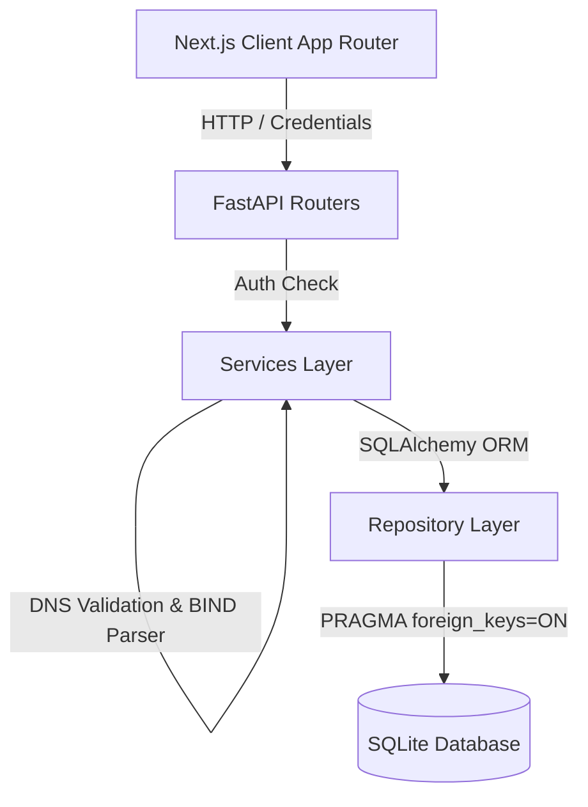

# AWS Route53 Web Application Clone

A full-featured clone of the **AWS Route53** web application built with **Next.js** (TypeScript) and **FastAPI** (Python), backed by **SQLite**. 

This application faithfully recreates the AWS Route53 user interface, navigation, table filters, record validators, cascading deletions, and core DNS management workflows using official **AWS Cloudscape Design System** components (`@cloudscape-design/components`).

---

## 🌟 Key Features & Bonus Scope

- **AWS Cloudscape UX**: 1:1 visual match with AWS Console layout (`AppLayout`, `TopNavigation`, `SideNavigation`, `BreadcrumbGroup`, `Tabs`, `Table`, `Pagination`, `Modal`, `Flashbar`).
- **Auto-Seeded AWS NS & SOA Records**: Creating a Hosted Zone automatically generates 4 authentic AWS Name Servers (`ns-xxx.awsdns-xx.org`) and SOA record, matching real AWS Route 53 behavior.
- **BIND Zone File Export (Bonus)**: Export any Hosted Zone and its records as standard BIND `.zone` file syntax or JSON format.
- **BIND Zone File Import (Bonus)**: Upload or paste BIND zone files to automatically parse `$ORIGIN`, `$TTL`, and record directives directly into a Hosted Zone.
- **Keyboard Shortcuts (Bonus)**: Hotkeys for quick navigation:
  - `C`: Open Create Zone / Record modal
  - `/`: Focus table search bar
  - `R`: Refresh current table
  - `Esc`: Close open modal
- **Dual Authentication**: Session persistence with both HTTP-Only Cookies and `Authorization: Bearer <token>` fallback for seamless cross-domain deployments (`vercel.app` -> `onrender.com`).
- **Hosted Zones & DNS Records CRUD**: Full CRUD with search, pagination, and type filtering for 9 common DNS record types (`A`, `AAAA`, `CNAME`, `TXT`, `MX`, `NS`, `PTR`, `SRV`, `CAA`).
- **Automated Pytest Suite**: Full API test coverage in `backend/tests/test_api.py`.

---

## 🏗 System Architecture & System Design Rationale



### Architectural Rationale
1. **Modular Monolith**: Single SQLite database file + tightly coupled zone/record domain + single deploy target means a 3-tier modular monolith is the optimal architectural call over distributed microservices.
2. **Layered Decoupling**: 
   - `routers/`: HTTP handling, request parsing, response formatting.
   - `services/`: DNS record format validation, BIND parsing/exporting, cascade checks.
   - `repositories/`: Database queries and entity operations.
3. **SQLite Foreign Key Enforcement**: SQLite requires per-connection FK enforcement. Handled via SQLAlchemy `@event.listens_for(Engine, "connect")` listener executing `PRAGMA foreign_keys=ON;` on every opened connection.

---

## 🗄 Database Schema

```sql
users (
  id INTEGER PRIMARY KEY,
  username TEXT UNIQUE NOT NULL,
  password_hash TEXT NOT NULL
);

hosted_zones (
  id INTEGER PRIMARY KEY,
  name TEXT NOT NULL,
  comment TEXT,
  is_private BOOLEAN DEFAULT FALSE,
  created_at TIMESTAMP DEFAULT CURRENT_TIMESTAMP,
  updated_at TIMESTAMP DEFAULT CURRENT_TIMESTAMP
);
CREATE INDEX idx_zones_name ON hosted_zones(name);

dns_records (
  id INTEGER PRIMARY KEY,
  hosted_zone_id INTEGER NOT NULL REFERENCES hosted_zones(id) ON DELETE CASCADE,
  name TEXT NOT NULL,
  type TEXT NOT NULL CHECK(type IN ('A','AAAA','CNAME','TXT','MX','NS','PTR','SRV','CAA','SOA')),
  ttl INTEGER NOT NULL DEFAULT 300,
  routing_policy TEXT NOT NULL DEFAULT 'simple',
  created_at TIMESTAMP DEFAULT CURRENT_TIMESTAMP,
  updated_at TIMESTAMP DEFAULT CURRENT_TIMESTAMP
);
CREATE INDEX idx_records_zone_name_type ON dns_records(hosted_zone_id, name, type);

record_values (
  id INTEGER PRIMARY KEY,
  record_id INTEGER NOT NULL REFERENCES dns_records(id) ON DELETE CASCADE,
  value TEXT NOT NULL
);
```

---

## 🔌 API Specifications

| Method | Endpoint | Description |
|---|---|---|
| `GET` | `/health` | Server health check (`{"status": "ok"}`) |
| `POST` | `/auth/login` | Login and set `auth_token` cookie & return Bearer token |
| `POST` | `/auth/logout` | Clear session cookie |
| `GET` | `/auth/me` | Fetch current session user |
| `GET` | `/hosted-zones` | List hosted zones (search, pagination) |
| `POST` | `/hosted-zones` | Create hosted zone (auto-seeds NS & SOA) |
| `GET` | `/hosted-zones/{id}` | Get hosted zone details |
| `PUT` | `/hosted-zones/{id}` | Update hosted zone comment |
| `DELETE` | `/hosted-zones/{id}` | Delete hosted zone (cascade deletes records & values) |
| `GET` | `/hosted-zones/{id}/export` | Export zone as BIND (`.zone`) or JSON |
| `POST` | `/hosted-zones/{id}/import` | Import BIND zone file content into zone |
| `GET` | `/hosted-zones/{id}/records` | List DNS records (search, type filter, pagination) |
| `POST` | `/hosted-zones/{id}/records` | Create DNS record |
| `PUT` | `/hosted-zones/{id}/records/{rec_id}` | Update DNS record |
| `DELETE` | `/hosted-zones/{id}/records/{rec_id}` | Delete DNS record |

---

## ⚙️ Local Setup & Automated Testing

### 1. Backend Setup & Automated Tests
```bash
cd backend
python -m venv venv
# On Windows:
.\venv\Scripts\activate
# On Linux/macOS:
source venv/bin/activate

pip install -r requirements.txt

# Run Automated Pytest Suite
python -m pytest tests/test_api.py -v

# Run FastAPI Dev Server
python -m uvicorn app.main:app --host 127.0.0.1 --port 8000 --reload
```

Default Admin Credentials:
- **Username**: `admin`
- **Password**: `admin123`

### 2. Frontend Setup
```bash
cd frontend
npm install
npm run dev
```

Open **`http://localhost:3000`** in your browser.

---

## 🚀 Live Hosted Demo
- **Live Frontend**: `https://route53-clone.vercel.app` (or your live Vercel URL)
- **Live Backend Health**: `https://route53-backend.onrender.com/health` (or your Render URL)
